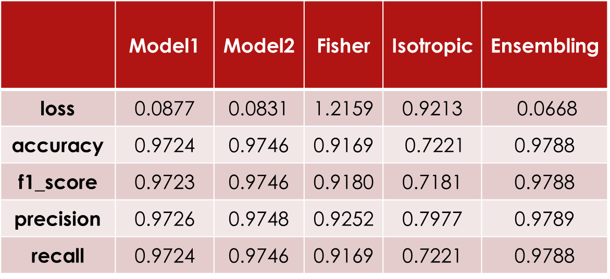
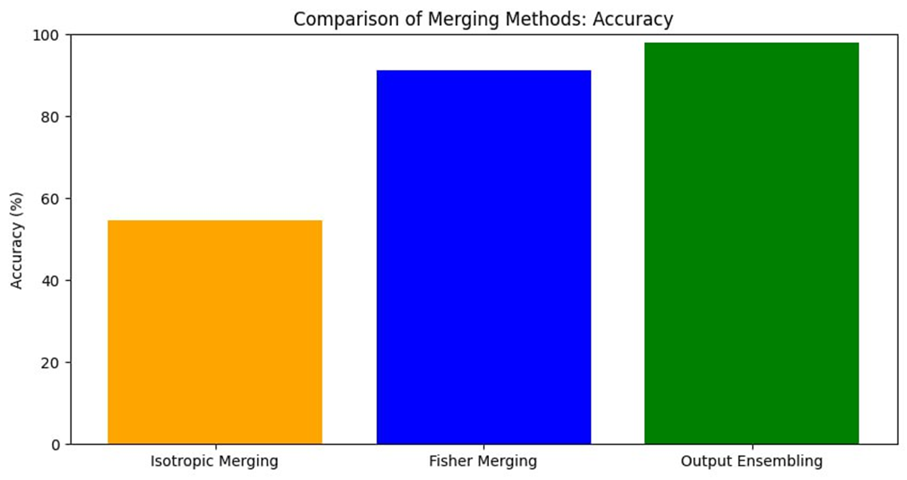
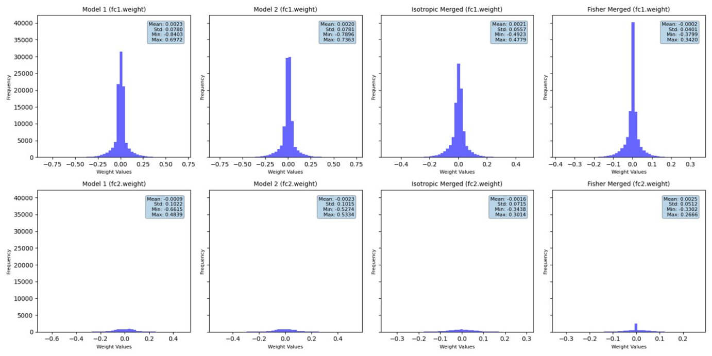

---

# **Merging Models with Fisher-Weighted Averaging**

This project explores the **Fisher-Weighted Averaging** method for merging neural network models. By leveraging the
Fisher Information Matrix, this technique combines models in a principled way, outperforming naive parameter averaging.
The project extends the experiments from *Merging Models with Fisher-Weighted Averaging* by Michael Matena and Colin
Raffel to noisy training, divergent datasets, and broader evaluation scenarios.

---

## **Overview**

### **Abstract**

Merging neural network models by averaging their parameters can provide efficient model combination. However,
isotropic (naive) merging often fails to preserve model accuracy due to its lack of consideration for parameter
importance. Fisher-Weighted Averaging addresses this limitation by incorporating the Fisher Information Matrix,
weighting parameters according to their significance in the original tasks.

This project evaluates Fisher Merging and its applications across:

- **Model Ensembling**: Combine predictions from multiple models.
- **Robust Fine-Tuning**: Adapt models to shifted domains.
- **Intermediate-Task Transfer Learning**: Facilitate domain/task transitions with minimal computation.
- **Domain Adaptation**: Improve domain-specific pretraining and performance.

---

## **Key Features**

- **Fisher-Weighted Averaging Implementation**:
  - Merging parameters using Fisher Information for improved accuracy and robustness.
- **Comparison of Merging Methods**:
  - Fisher Merging, Isotropic Merging, and Output Ensembling.
- **Noisy Training Pipelines**:
  - Train models with input and label noise to assess merging robustness.
- **Support for Divergent Datasets**:
  - Merging models trained on different datasets, such as MNIST and Fashion-MNIST.
- **Comprehensive Evaluation**:
  - Metrics include Accuracy, F1-Score, Precision, and Recall.
- **Visualization Tools**:
  - Generate comparison charts and layer distribution plots for detailed analysis.

---

## **Project Structure**

```
model-merging/
├── notebooks/
│   └── NN-Model-Merging.ipynb         # Jupyter notebook for exploring and testing merging methods
├── src/
│   ├── core/                          # Core implementations for model merging and related pipelines
│   │   ├── cli_tool.py                # Command-line interface implementation
│   │   ├── fisher_information_visualization_pipeline.py  # Pipeline for visualizing Fisher Information
│   │   ├── fisher_scaling_experiment.py  # Experiments on Fisher scaling factor
│   │   ├── fisher_weighted_averaging.py  # Fisher-weighted merging method
│   │   ├── generalization_pipeline.py    # Testing merging generalization across architectures
│   │   ├── isotropic_merging.py          # Naive merging method
│   │   ├── output_ensemble_merging.py    # Output ensembling method
│   │   └── training_pipeline.py          # Training and testing pipeline for models
│   ├── data/                             # Data directory 
│   │   ├── cifar-10-batches-py/          # CIFAR-10 dataset files
│   │   ├── FashionMNIST/                 # FashionMNIST dataset files
│   │   ├── MNIST/                        # MNIST dataset files
│   │   └── cifar-10-python.tar.gz        # CIFAR-10 dataset archive
│   ├── models/                           # Model architectures
│   │   ├── base_model.py                 # Base class for models
│   │   ├── cifar10_models.py             # CIFAR-10 models (ResNet, VGG)
│   │   └── mnist_model.py                # MNIST models (MLP, CNN)
│   └── utils/                            # Utility scripts for dataset loading, noise, and model IO
│       ├── dataset_loader.py             # Dataset loader utilities
│       ├── model_io.py                   # Utilities for saving/loading models
│       ├── noisy_training_utils.py       # Noise augmentation utilities
│       └── utiliy.py                     # Additional helper functions (validation, plotting)
├── .gitignore                           # Git ignore file
├── .python-version                      # Python version used in the project
├── LICENSE                              # MIT License
├── README.md                            # Project documentation
├── main.py                              # CLI entry point for executing the project
└── requirements.txt                     # Python dependencies
```

---

## **Setup**

### **1. Clone the Repository**

```bash
git clone https://github.com/ashkanans/model-merging
cd model-merging
```

### **2. Create a Virtual Environment**

```bash
python -m venv venv
```

- **Activate the environment**:
  - On **Linux/macOS**: `source venv/bin/activate`
  - On **Windows**: `venv\Scripts\activate`

### **3. Install Dependencies**

```bash
pip install -r requirements.txt
```

---

## **Usage**

This project uses a CLI tool (`main.py`) to run experiments. Below are examples of how to execute various commands:

### **1. Train Models**

Train two models on MNIST for 10 epochs:

```bash
python main.py --command train --dataset mnist --model mlp --epochs 10
```

### **2. Merge Models**

Merge the trained models using Fisher-weighted averaging:

```bash
python main.py --command merge --dataset mnist --model mlp --merge_type fisher --alpha 0.5
```

### **3. Validate Models**

Evaluate the performance of the merged models:

```bash
python main.py --command validate --dataset mnist --model mlp
```

### **4. Visualize Results**

Generate comparison charts and layer distribution plots:

```bash
python main.py --command visualize --dataset mnist --model mlp --comparison_chart --layer_dist
```

### **5. Train Models with Noise**

Train both models with noisy inputs and labels:

```bash
python main.py --command train --dataset mnist --model mlp --noisy_models model1 model2
```

### **6. Merge Divergent Datasets**

Merge models trained on MNIST and Fashion-MNIST:

```bash
python main.py --command train merge validate visualize --dataset mnist fashion-mnist --model mlp
```

---

## **An Exmaple Execution**

### **1. Performing a Train, Merge, Validate and Visualization of two MLP using MNIST dataset**

```bash
python main.py python main.py --command train merge validate visualize --dataset mnist --model mlp 
```





## **Notebook**

A comprehensive notebook has been created for this project, titled [NN-Model-Merging](notebooks/NN-Model-Merging.ipynb),
which serves as an interactive guide to understanding and experimenting with the core concepts and techniques
implemented in the project.

---

## **Acknowledgments**

This project builds on the research presented in:

> *Merging Models with Fisher-Weighted Averaging*  
> Michael Matena, Colin Raffel  
> [arXiv:2111.09832](https://arxiv.org/abs/2111.09832)

---

## **License**

This project is licensed under the [MIT License](LICENSE).

---

